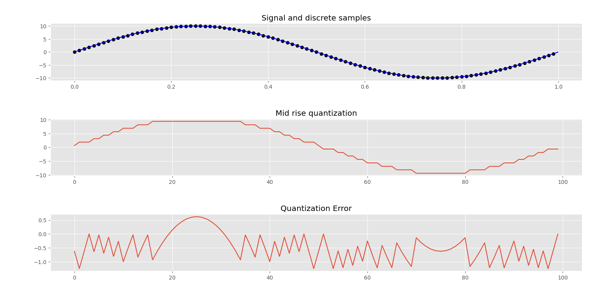

# digital-communications

Implemented in Python, this project simulates a mid rise quantization of a signal wave, calculating its quantization error and plotting its results. The parameters are changeable.

